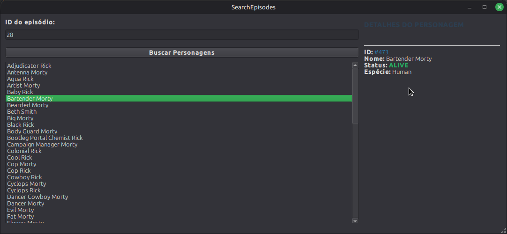

# 🚀 ZRPEpisodes - Rick & Morty API Explorer

**ZRPEpisodes** é uma aplicação desktop desenvolvida em **C++** com o framework **Qt 6**, que permite explorar os episódios e personagens da série *Rick and Morty*. O projeto consome a API REST oficial para buscar dados de episódios e listar seus respectivos personagens de forma organizada e eficiente.

---

## 🛠️ Tecnologias e Padrões de Projeto

* **Framework:** Qt 6.8.0
* **Sistema de Build:** CMake
* **Testes:** QtTest (QTestLib)
* **Arquitetura:**
    * **Models:** Classes `Character` e `Episode` mapeadas para objetos.
    * **Service:** `ApiClient` centraliza requisições assíncronas via `QNetworkAccessManager`.
    * **View:** Interface baseada em `.ui` (Qt Designer) com suporte a *Rich Text*.
* **Patterns:** Uso de *Signals & Slots*, *Smart Pointers* e *Implicit Sharing*.

---

## 📸 Interface



### Como usar:
1.  Insira um **ID de episódio** válido no campo de busca.
2.  Clique no botão **Pesquisar**.
3.  A lista lateral será populada com os nomes dos personagens em **ordem alfabética**.
4.  Clique em um personagem para ver os **detalhes completos** no painel lateral.

---

## ⚙️ Build and Run

```bash
# 1. Clone o projeto
git clone https://github.com/jailsonlinux/zrpepisodes.git
cd zrpepisodes

# 2. Prepare o ambiente de build
mkdir build && cd build

# 3. Configure (Ajuste o caminho para o seu path do Qt)
cmake -DCMAKE_PREFIX_PATH=/path/to/Qt/6.8.0/gcc_64 ..

# 4. Compile
cmake --build . --target all

# 5. Execute
./zrpepisodes

🧪 Testes Unitários
O projeto utiliza o QtTest para garantir a integridade do parsing de dados.

Para rodar os testes:

Bash

cd build
ctest --output-on-failure
Desenvolvido por **Jailson** jotalinux2@gmail.com
